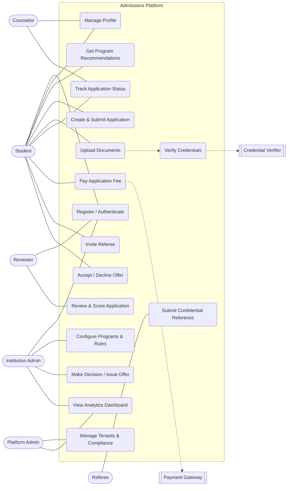
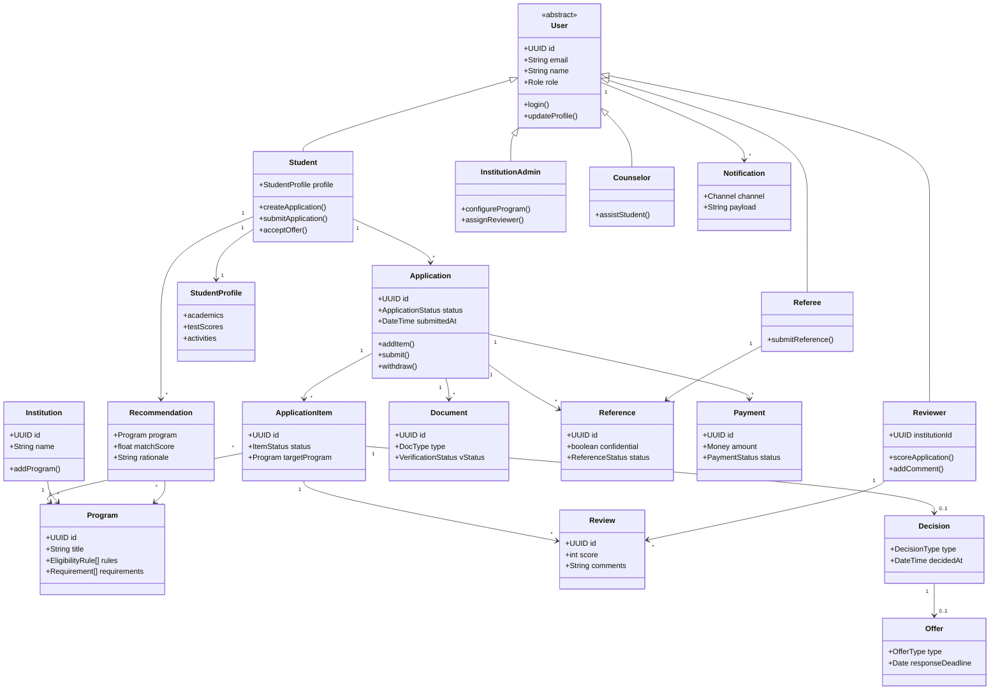
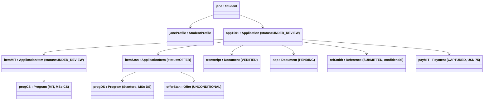
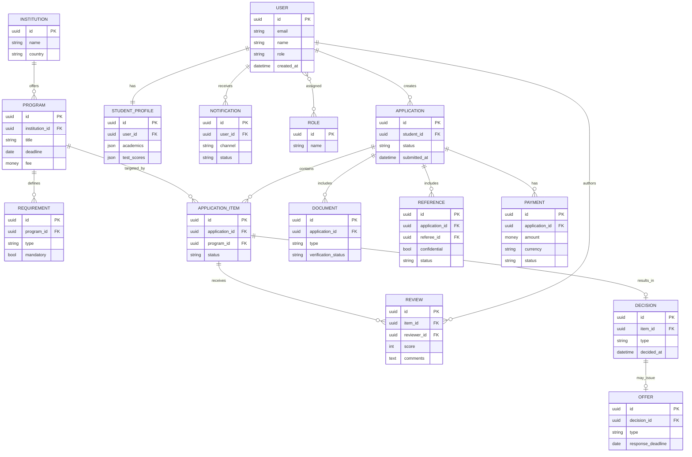
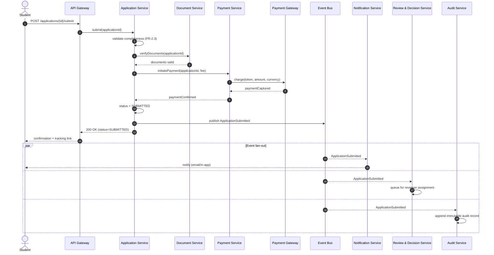
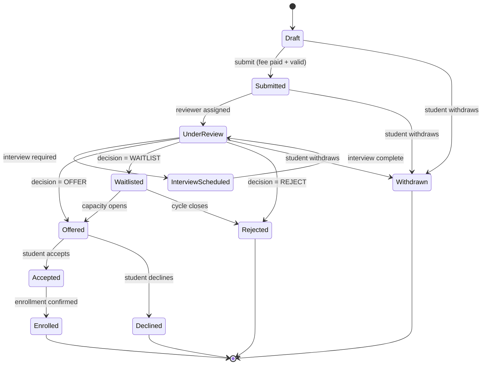
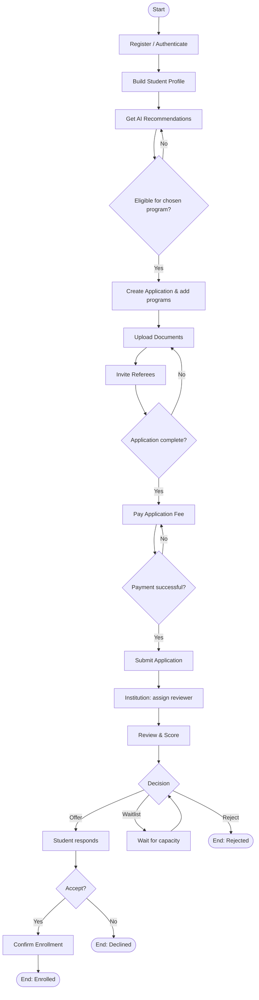
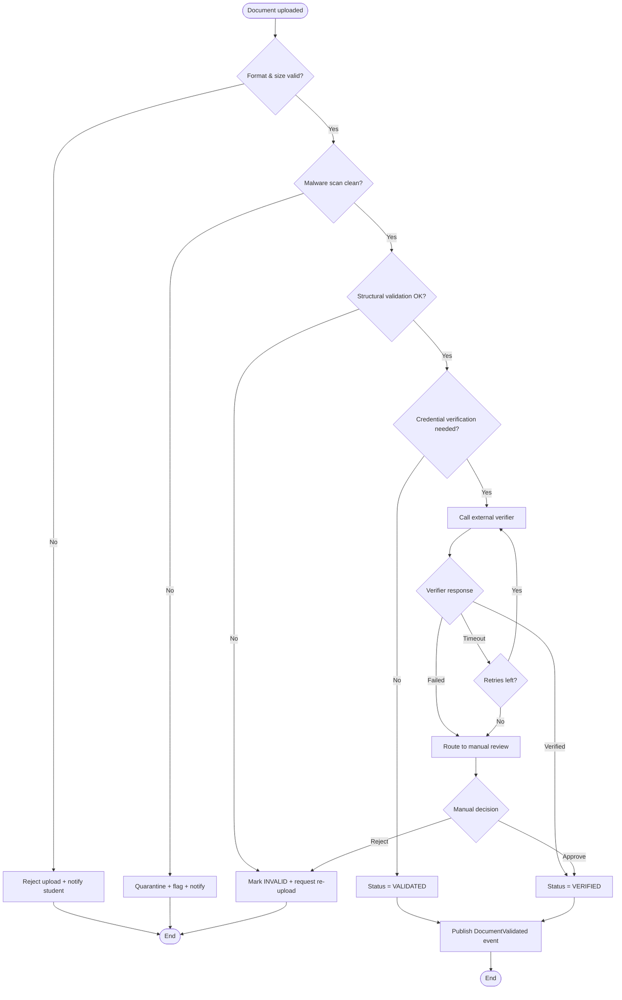

# Digital University Admissions & Application Management Platform
### Solution Design & Architecture Kata

> **Document type:** Architecture & Design Specification
> **Scope:** Functional analysis, domain model, service decomposition, API surface, and full UML/diagram set derived from the problem statement.
> **Audience:** Architects, engineering leads, product owners, reviewers.

---

## Table of Contents

1. [Solution Overview](#1-solution-overview)
2. [Functional Requirements](#2-functional-requirements)
3. [Non-Functional Requirements](#3-non-functional-requirements)
4. [Actors](#4-actors)
5. [Microservices — Identification & Catalogue](#5-microservices--identification--catalogue)
6. [Use-Case Diagram](#6-use-case-diagram)
7. [Class Diagram](#7-class-diagram)
8. [Object Diagram](#8-object-diagram)
9. [ER Diagram](#9-er-diagram)
10. [Sequence Diagram](#10-sequence-diagram)
11. [State Diagram](#11-state-diagram)
12. [Activity Diagram](#12-activity-diagram)
13. [Flow Chart](#13-flow-chart)
14. [API Specification](#14-api-specification)
15. [Guiding Principles — SOLID, KISS, YAGNI](#15-guiding-principles--solid-kiss-yagni)

---

## 1. Solution Overview

The platform is a **centralized, multi-tenant admissions hub** that connects prospective students with multiple higher-education institutions. It replaces the fragmented, institution-by-institution portal landscape with a single application surface, transparent real-time tracking, collaborative institution-side review, AI-assisted program matching, and integrated payment, verification, communication, and compliance.

**Core value drivers**

| Pain point (today) | Platform response |
|---|---|
| Students re-enter data per portal | One profile → many applications ("apply once, apply to many") |
| Opaque status | Real-time, event-driven status tracking |
| Manual review at peak load | Collaborative review workflow + elastic, independently scalable services |
| Disparate institution systems | Integration APIs (SIS, CRM, payment, credential services) |
| Reactive, fragmented process | Proactive notifications, analytics, data-driven decisions |

**Architectural stance:** event-driven microservices behind an API gateway, organized by **Domain-Driven Design (DDD) bounded contexts**, with each service owning its data (database-per-service) and communicating via synchronous REST for queries/commands and asynchronous events for state propagation.

---

## 2. Functional Requirements

Requirements are grouped into capability areas and given stable IDs (`FR-<area>.<n>`) so they can be traced to use cases, services, and APIs throughout the document.

### FR-1 — User Management & Access Control
- **FR-1.1** Multi-tiered self-registration for Students, University staff (Admin/Reviewer), Counselors, Partners, and Referees.
- **FR-1.2** Role-Based Access Control (RBAC) with least-privilege scopes per role and per tenant (institution).
- **FR-1.3** Authentication with MFA; SSO/SAML/OIDC federation for institutional users.
- **FR-1.4** Profile lifecycle: create, edit, verify (email/phone), deactivate, GDPR delete/export.
- **FR-1.5** Delegated access (e.g., a counselor acting on behalf of a student) with explicit consent and audit.

### FR-2 — Student Application Management
- **FR-2.1** Build a reusable student profile (academics, test scores, activities, essays).
- **FR-2.2** Create applications and target **multiple institutions/programs** from one workspace.
- **FR-2.3** Save drafts; validate completeness before submission.
- **FR-2.4** Attach documents per application/program requirement.
- **FR-2.5** Submit, withdraw, and resubmit (where allowed) applications.
- **FR-2.6** Real-time status tracking across all target institutions.
- **FR-2.7** Receive decisions; accept/decline offers; respond to waitlist.

### FR-3 — Institution Application Processing
- **FR-3.1** Configure institution profile, programs, intakes, deadlines, eligibility rules, and required documents.
- **FR-3.2** Receive and queue incoming applications per program.
- **FR-3.3** Assign applications to reviewers; support reviewer pools and load balancing.
- **FR-3.4** Collaborative review: scoring rubrics, comments, multi-reviewer aggregation.
- **FR-3.5** Shortlist, schedule interviews (optional), and record decisions.
- **FR-3.6** Issue offers (conditional/unconditional), rejections, and waitlist positions.
- **FR-3.7** Manage capacity and waitlist promotion.

### FR-4 — Intelligent Matching & Recommendations
- **FR-4.1** Recommend suitable programs from a student profile.
- **FR-4.2** Eligibility pre-checks against program rules.
- **FR-4.3** Admit-likelihood signals using historical outcomes (reach/match/safety banding).
- **FR-4.4** Explainable recommendations (why this program was suggested).

### FR-5 — Communication Hub
- **FR-5.1** In-app threaded messaging between students, institutions, counselors.
- **FR-5.2** Automated notifications for milestones, deadlines, and status changes.
- **FR-5.3** Multi-channel delivery (in-app, email, SMS, push) with user preferences.
- **FR-5.4** Templated, localized, and schedulable messages.

### FR-6 — Document Verification & Validation
- **FR-6.1** Secure upload with format, size, and malware (AV) checks.
- **FR-6.2** Automated structural validation (e.g., transcript fields present).
- **FR-6.3** Integration with external credential/identity verification services.
- **FR-6.4** Verification status lifecycle and re-request on failure.

### FR-7 — Reference & Recommendation Management
- **FR-7.1** Student invites referees by email; system issues secure, time-bound links.
- **FR-7.2** Referees submit **confidential** recommendations not visible to the student.
- **FR-7.3** Automated reminders and submission tracking.
- **FR-7.4** Reference attached to the application and released only to institutions.

### FR-8 — Analytics & Reporting Dashboard
- **FR-8.1** Student dashboard: application progress, deadlines, outcomes.
- **FR-8.2** Institution dashboard: funnel (received → reviewed → offered → accepted), reviewer throughput, demographics.
- **FR-8.3** Platform admin dashboard: usage, SLA, revenue, tenant health.
- **FR-8.4** Custom report builder and export (CSV/PDF).

### FR-9 — Integration Capabilities
- **FR-9.1** REST/webhook APIs for institutional SIS and CRM.
- **FR-9.2** Payment gateway integration.
- **FR-9.3** Credential verification service integration.
- **FR-9.4** Inbound/outbound webhooks for status events.

### FR-10 — Payment & Financial Management
- **FR-10.1** Configurable application fees per institution/program.
- **FR-10.2** Secure, PCI-compliant payment processing (tokenized).
- **FR-10.3** Multi-currency support with FX display.
- **FR-10.4** Refunds, fee waivers, receipts, and invoices.

### FR-11 — Compliance & Audit
- **FR-11.1** Immutable audit trail of all material actions.
- **FR-11.2** Data privacy compliance (GDPR/FERPA): consent, retention, right-to-erasure.
- **FR-11.3** Regulatory and statutory reporting.
- **FR-11.4** Configurable data residency per tenant.

### FR-12 — Multi-Channel Access
- **FR-12.1** Responsive web and mobile-optimized experiences.
- **FR-12.2** WCAG 2.1 AA accessibility.
- **FR-12.3** Internationalization/localization (i18n/l10n).

---

## 3. Non-Functional Requirements
*(Optional per the kata — included because they directly shape the architecture.)*

| # | Category | Requirement |
|---|---|---|
| NFR-1 | **Performance** | P95 API latency < 500 ms for reads; < 1.5 s for writes under nominal load. |
| NFR-2 | **Scalability** | Horizontal autoscaling; absorb 10× application volume during peak admission windows without degradation. |
| NFR-3 | **Availability** | 99.9% monthly uptime; no single point of failure; graceful degradation of non-critical services. |
| NFR-4 | **Security** | Encryption in transit (TLS 1.2+) and at rest; tokenized payments; OWASP Top-10 hardening; secrets management. |
| NFR-5 | **Privacy & Compliance** | GDPR/FERPA by design; consent ledger; configurable retention and residency. |
| NFR-6 | **Reliability/Consistency** | Eventual consistency across services via events; exactly-once side-effects via idempotency keys + outbox pattern. |
| NFR-7 | **Observability** | Centralized logs, metrics, distributed tracing; correlation IDs end-to-end. |
| NFR-8 | **Maintainability** | Independently deployable services; contract-tested APIs; SOLID/KISS/YAGNI adherence. |
| NFR-9 | **Usability/Accessibility** | WCAG 2.1 AA; localized; mobile-first. |
| NFR-10 | **Interoperability** | Open REST + webhook contracts; standards-based auth (OIDC/SAML). |

---

## 4. Actors

Actors are split into **primary** (initiate value), **supporting/system** (external systems the platform integrates with), and **offstage** (have an interest but don't directly interact).

### Primary (human) actors

| Actor | Description | Key goals |
|---|---|---|
| **Prospective Student / Applicant** | Person seeking admission. | Build profile, get recommendations, apply to many institutions, track status, pay, accept offers. |
| **Admissions Officer / Reviewer** | Institution staff who evaluates applications. | Review, score, comment, recommend decisions. |
| **Institution Administrator** | Manages an institution tenant. | Configure programs, deadlines, rules, reviewer assignments, capacity. |
| **Counselor / Advisor** | Guides students (school or independent). | Assist/track student applications (with consent), advise. |
| **Referee / Recommender** | Submits confidential references. | Submit recommendation securely on time. |
| **Partner Organization** | Agencies, sponsors, recruiters. | Manage cohorts of applicants, view aggregate status. |
| **Platform Administrator** | Operates the platform itself. | Onboard tenants, monitor health, manage compliance, configuration. |

### Supporting / external system actors

| System actor | Role |
|---|---|
| **Payment Gateway** | Processes fees, refunds, multi-currency settlement. |
| **Credential Verification Service** | Validates transcripts/degrees/identity. |
| **Notification Providers** | Email / SMS / Push delivery. |
| **Institutional SIS / CRM** | Receives admitted-student data; syncs leads. |
| **Identity Provider (IdP)** | SSO/SAML/OIDC for institutional users. |
| **Object Storage / AV Scanner** | Stores documents; scans for malware. |
| **AI / Matching Engine** | Generates program recommendations (internal service backed by ML). |

### Offstage actors
Regulators/Accreditation bodies (consume compliance reports), University departments/faculty (downstream consumers of decisions).

---

## 5. Microservices — Identification & Catalogue

### 5.1 How services were identified

The decomposition is **Domain-Driven Design first**, not technology-first. The method:

1. **Event Storming the admissions lifecycle** to surface domain events (`ApplicationSubmitted`, `DocumentVerified`, `DecisionMade`, `PaymentCaptured`, …).
2. **Group events/commands into bounded contexts** where the language and rules are internally consistent (e.g., "Review" means something specific inside the institution context, distinct from "Application" in the student context).
3. **Apply the Single Responsibility Principle at service granularity** — one service = one business capability with one reason to change.
4. **Data ownership / autonomy** — each service owns its schema (database-per-service); no shared tables. This avoids the distributed-monolith trap.
5. **Independent scalability & failure isolation** — capabilities with very different load/availability profiles are separated. Document processing and notifications spike on deadline days; payments need PCI isolation; analytics is read-heavy and can lag. These pressures justify separate services even where the domain might tolerate merging.
6. **Compliance isolation** — audit and PII-sensitive concerns are isolated so they can be hardened and governed independently.
7. **YAGNI guardrail** — we stop at the granularity the requirements justify; we do *not* split into nano-services speculatively (see §15).

### 5.2 Service catalogue

| # | Service | Bounded context | Core responsibility | Owns (key entities) | Why it is its own service |
|---|---|---|---|---|---|
| 1 | **Identity & Access Service (IAM)** | Identity & Access | AuthN, MFA, SSO federation, RBAC, tenancy | User, Role, Permission, Session | Cross-cutting security concern; must be hardened & independently audited. |
| 2 | **Student Profile Service** | Applicant | Reusable student profile, academics, achievements | StudentProfile, Education, TestScore | Distinct "apply-once" data, separate from any single application. |
| 3 | **Institution & Program Catalog Service** | Institution Setup | Institutions, programs, intakes, eligibility rules, requirements | Institution, Program, Intake, Requirement | Reference/config data with read-heavy access; changes on a different cadence. |
| 4 | **Application Service** | Application (core) | Application aggregate, drafts, submission, status orchestration | Application, ApplicationItem, ApplicationStatus | The transactional heart; high write volume; orchestrates other contexts. |
| 5 | **Document Service** | Documents | Upload, storage, format/AV validation | Document, DocumentMetadata | Heavy I/O + storage; scales independently; spikes on deadlines. |
| 6 | **Verification Service** | Verification | Credential/identity verification via external providers | VerificationRequest, VerificationResult | Wraps slow external calls; isolates third-party failure. |
| 7 | **Reference Service** | References | Confidential referee workflow & submission | ReferenceRequest, Recommendation | Strict confidentiality boundary distinct from student-visible data. |
| 8 | **Review & Decision Service** | Admissions Review | Reviewer assignment, scoring, decisions, offers, waitlist | Review, Score, Decision, Offer, ReviewerAssignment | Institution-side workflow with its own rules and collaboration model. |
| 9 | **Matching & Recommendation Service** | Recommendations | AI-driven program suggestions & eligibility scoring | RecommendationSet, MatchScore | ML/compute profile differs entirely from CRUD services. |
| 10 | **Communication / Notification Service** | Communication | Messaging, notifications, multi-channel delivery | Message, Notification, Template, Preference | Bursty fan-out workload; decoupled via events. |
| 11 | **Payment Service** | Payments | Fees, multi-currency, refunds, waivers, receipts | Payment, Invoice, Refund, FeeWaiver | PCI scope must be isolated; integrates a regulated external gateway. |
| 12 | **Analytics & Reporting Service** | Analytics | KPIs, dashboards, custom reports, exports | ReportDefinition, Metric, Dashboard | Read-optimized (CQRS read side); must not burden transactional stores. |
| 13 | **Integration / Gateway Service** | Integration | Outbound/inbound APIs & webhooks to SIS/CRM/external | IntegrationConfig, WebhookSubscription | Anti-corruption layer shielding the core from external schemas. |
| 14 | **Audit & Compliance Service** | Compliance | Immutable audit trail, consent ledger, retention, regulatory reports | AuditEvent, Consent, RetentionPolicy | Must be append-only, tamper-evident, separately governed. |

**Cross-cutting platform components (not domain services):** API Gateway, Service Discovery/Config, Message Broker (event bus), centralized Observability stack. These are infrastructure, deliberately kept out of the domain service list.

### 5.3 Communication style
- **Synchronous (REST/gRPC)** for client-facing queries and commands via the API Gateway.
- **Asynchronous (events over the broker)** for state propagation: e.g., `ApplicationSubmitted` → Document, Payment, Notification, Analytics, Audit react independently.
- **Outbox + idempotency** for reliable, exactly-once side-effects (NFR-6).

---

## 6. Use-Case Diagram

Mermaid has no native UML use-case notation, so actors are rendered as nodes and use cases as rounded nodes grouped inside the system boundary.



---

## 7. Class Diagram

Domain model (core aggregates and relationships). Methods shown are representative, not exhaustive.



---

## 8. Object Diagram

A runtime snapshot: one student (*Jane*) with a single application targeting two programs, mid-process.



---

## 9. ER Diagram

Logical data model. In the deployed system each bounded context owns its own schema (database-per-service); this ER view is the consolidated logical model for clarity.



---

## 10. Sequence Diagram

**Scenario:** Student submits an application (with payment, document validation, and event-driven downstream processing).



---

## 11. State Diagram

**Subject:** Lifecycle of an `ApplicationItem` (one program target within an application).



---

## 12. Activity Diagram

**Process:** End-to-end applicant journey, with decision points (swimlane-style grouping via subgraphs).



---

## 13. Flow Chart

**Process:** Document Verification & Validation (FR-6) — distinct from the journey above, focused on a single subsystem's logic.



---

## 14. API Specification

REST over HTTPS, JSON bodies, OAuth2/OIDC bearer tokens, tenant-scoped, versioned under `/api/v1`. All write endpoints accept an `Idempotency-Key` header (NFR-6). Standard codes: `200/201` success, `400` validation, `401/403` auth, `404` not found, `409` conflict, `422` business rule, `429` rate limit.

### 14.1 Endpoint summary (by service)

| Service | Method & Path | Description | Auth (role) |
|---|---|---|---|
| IAM | `POST /api/v1/auth/register` | Register a user | Public |
| IAM | `POST /api/v1/auth/login` | Authenticate, returns tokens | Public |
| IAM | `POST /api/v1/auth/mfa/verify` | Verify MFA challenge | User |
| Profile | `GET /api/v1/students/{id}/profile` | Fetch profile | Student/Counselor |
| Profile | `PUT /api/v1/students/{id}/profile` | Update profile | Student |
| Catalog | `GET /api/v1/institutions` | List institutions | Any |
| Catalog | `GET /api/v1/programs?institutionId=` | List/filter programs | Any |
| Catalog | `POST /api/v1/institutions/{id}/programs` | Create a program | Inst. Admin |
| Application | `POST /api/v1/applications` | Create draft application | Student |
| Application | `POST /api/v1/applications/{id}/items` | Add a program target | Student |
| Application | `POST /api/v1/applications/{id}/submit` | Submit application | Student |
| Application | `GET /api/v1/applications/{id}` | Get application + status | Student/Counselor |
| Application | `POST /api/v1/applications/{id}/withdraw` | Withdraw | Student |
| Document | `POST /api/v1/applications/{id}/documents` | Upload document | Student |
| Document | `GET /api/v1/documents/{id}/status` | Verification status | Student/Inst. |
| Reference | `POST /api/v1/applications/{id}/references/invite` | Invite a referee | Student |
| Reference | `POST /api/v1/references/{token}/submit` | Submit confidential reference | Referee (token) |
| Matching | `GET /api/v1/students/{id}/recommendations` | Get program recommendations | Student |
| Review | `GET /api/v1/institutions/{id}/queue` | Review queue | Reviewer |
| Review | `POST /api/v1/items/{id}/reviews` | Submit score/comments | Reviewer |
| Review | `POST /api/v1/items/{id}/decision` | Record decision/offer | Inst. Admin |
| Application | `POST /api/v1/offers/{id}/respond` | Accept/decline offer | Student |
| Payment | `POST /api/v1/applications/{id}/payments` | Pay application fee | Student |
| Payment | `POST /api/v1/payments/{id}/refund` | Refund | Inst. Admin |
| Notification | `GET /api/v1/users/{id}/notifications` | List notifications | User |
| Analytics | `GET /api/v1/institutions/{id}/analytics` | Institution KPIs | Inst. Admin |
| Integration | `POST /api/v1/webhooks/subscriptions` | Register a webhook | Inst. Admin |
| Audit | `GET /api/v1/audit?entityId=` | Query audit trail | Platform Admin |

### 14.2 Representative OpenAPI fragment

```yaml
openapi: 3.0.3
info:
  title: University Admissions Platform API
  version: 1.0.0
paths:
  /api/v1/applications/{id}/submit:
    post:
      summary: Submit an application for processing
      operationId: submitApplication
      parameters:
        - name: id
          in: path
          required: true
          schema: { type: string, format: uuid }
        - name: Idempotency-Key
          in: header
          required: true
          schema: { type: string }
      responses:
        '200':
          description: Submitted
          content:
            application/json:
              schema:
                type: object
                properties:
                  applicationId: { type: string, format: uuid }
                  status: { type: string, example: SUBMITTED }
                  trackingUrl: { type: string }
        '409': { description: Already submitted }
        '422': { description: Incomplete application or fee unpaid }
      security:
        - oauth2: [student]
components:
  securitySchemes:
    oauth2:
      type: oauth2
      flows:
        authorizationCode:
          authorizationUrl: /oauth/authorize
          tokenUrl: /oauth/token
          scopes:
            student: Student actions
            reviewer: Reviewer actions
            admin: Institution admin actions
```

---

## 15. Guiding Principles — SOLID, KISS, YAGNI

### 15.1 SOLID

| Principle | How it is applied in this design |
|---|---|
| **S — Single Responsibility** | Each microservice maps to exactly one business capability with one reason to change (e.g., Payment ≠ Application). At class level, `Application` orchestrates application state while `Payment`, `Document`, `Review` own their own concerns. |
| **O — Open/Closed** | New notification channels, payment providers, or credential verifiers are added by implementing an interface (`NotificationChannel`, `PaymentProvider`, `Verifier`) — no change to existing code. New document types extend the validation strategy registry. |
| **L — Liskov Substitution** | `Student`, `Reviewer`, `Counselor`, `Referee` all substitute for `User` wherever a `User` is expected (auth, notifications) without breaking behavior. Any `PaymentProvider` implementation is interchangeable behind the Payment Service. |
| **I — Interface Segregation** | Role-specific, narrow API contracts: a Reviewer client depends only on review endpoints, never on payment or admin contracts. Internal ports are split (`DocumentValidator` vs `CredentialVerifier`) so consumers don't depend on methods they don't use. |
| **D — Dependency Inversion** | Services depend on abstractions (ports) not concretions: the Application Service depends on a `PaymentPort`, not on Stripe/PayPal; integrations are injected adapters (Hexagonal/Ports-and-Adapters). The external gateway is an implementation detail. |

### 15.2 KISS (Keep It Simple)
- **Synchronous REST for client commands, events only where decoupling pays off** — we don't event-source everything; only cross-service state propagation uses the bus.
- **One status model per aggregate** with a clear, documented state machine (§11) rather than scattered boolean flags.
- **Consolidated logical data model** with database-per-service ownership — simple to reason about, no shared mutable tables.
- **Reuse a single Notification Service** for all channels instead of bespoke notification logic in each service.

### 15.3 YAGNI (You Aren't Gonna Need It)
- **No speculative nano-services** — e.g., Verification and external credential checks live in one Verification Service until load proves a split is needed; Reference and Review are kept separate only because confidentiality rules genuinely differ.
- **No premature multi-region/data-residency engine** — residency is a configurable policy hook (FR-11.4), implemented when a tenant actually requires it, not pre-built.
- **No custom ML platform** — Matching Service starts with rules + a hosted model; a bespoke training pipeline is deferred until recommendation quality demands it.
- **NFRs documented but implemented incrementally** — autoscaling and observability are foundational; exotic capabilities (e.g., real-time fraud scoring on payments) are deferred until justified.

---

### Document Notes
- Each diagram is authored in Mermaid so it renders in compatible viewers and remains version-controllable and editable.
- Requirement IDs (`FR-x.y`, `NFR-n`) are stable anchors for traceability across the use cases, services, and APIs.
